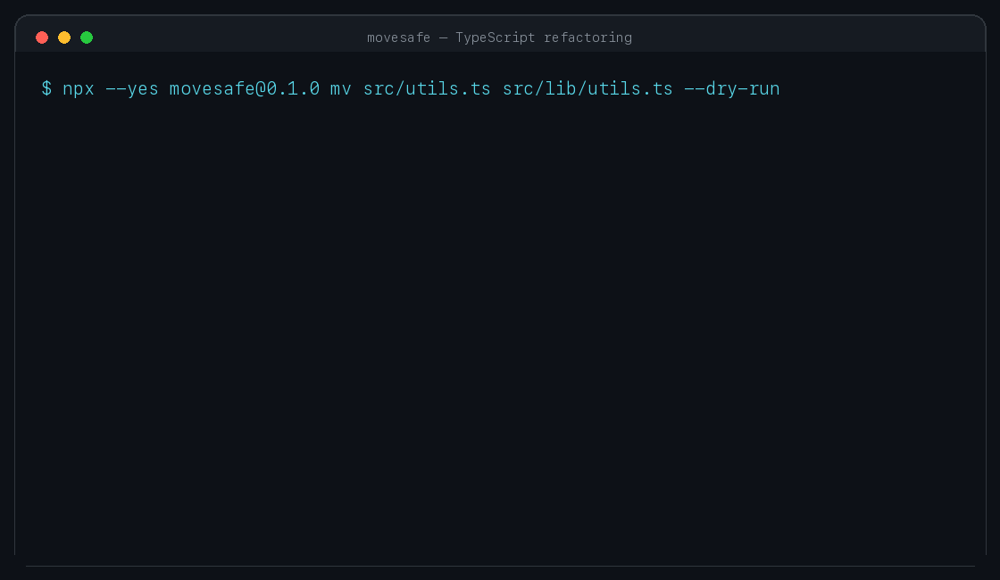

# movesafe

[](https://github.com/endrilickollari/movesafe/actions/workflows/ci.yml)
[](https://www.npmjs.com/package/movesafe)
[](LICENSE)

Move TypeScript files without leaving broken imports behind.

Movesafe is a headless refactoring tool for developers, CI, and coding agents. It builds an import graph with the TypeScript compiler, plans every edit before touching disk, verifies the resulting project, and applies the move through rollback-oriented file swaps.



## Quickstart

Requires Node.js 22.13 or newer.

```bash
# Preview the move and inspect the diff.
npx --yes movesafe@0.1.0 mv src/utils.ts src/lib/utils.ts --dry-run

# Apply the same move and repair its importers.
npx --yes movesafe@0.1.0 mv src/utils.ts src/lib/utils.ts

# Check the project afterwards.
npx --yes movesafe@0.1.0 check .
```

Movesafe finds the nearest `tsconfig.json`. In a monorepo without a root config, run it from a package or pass a path below that package's config.

## What it handles

- Static imports, type imports, re-exports, `require()` calls, and literal dynamic imports.
- Relative specifiers, `tsconfig` aliases, barrels, workspace packages, and project references.
- File, directory, and cross-package moves through one verified move plan.
- Filename-case mismatches that work locally but fail on case-sensitive systems.

Computed import specifiers are reported and never guessed.

## Check imports

`check` reports unresolved imports, stale or orphaned barrel exports, and filename-case mismatches. Install the checked project's dependencies first so TypeScript can resolve external packages.

```bash
npx --yes movesafe@0.1.0 check .          # terminal report
npx --yes movesafe@0.1.0 check . --json   # machine-readable output
npx --yes movesafe@0.1.0 check . --md     # Markdown for CI summaries
```

The command exits with status `1` when it finds an error, making it suitable for pre-commit hooks and CI.

## Validated on real repositories

The v0.1 benchmark applied **7 file and directory moves across 4 real TypeScript repositories**—Zustand, type-fest, Ky, and class-validator—then confirmed no Movesafe checker errors and no increase in TypeScript errors.

The harness also records safely refused moves and repository-specific setup failures instead of treating them as successes. See the [v0.1 benchmark report](packages/benchmark/results/v0.1.0.md) for the method, results, and limitations.

## Why not just use the IDE?

An IDE refactor is ideal when a person is present, one editor owns the project, and the move stays inside its configured workspace. Movesafe is for the other path:

- a coding agent needs a reviewable plan before it writes;
- a script needs the same behavior without opening an editor;
- a move crosses package boundaries in a monorepo;
- CI needs to detect damage introduced by any tool.

Movesafe does not replace editor refactors. It makes the refactoring operation available as a deterministic CLI and SDK contract.

## Agents and MCP

Run the MCP server directly from npm:

```json
{
  "mcpServers": {
    "movesafe": {
      "command": "npx",
      "args": ["--yes", "@movesafe/mcp@0.1.0"]
    }
  }
}
```

It exposes three tools:

- `plan_move` computes a read-only plan, diff, diagnostics, and deterministic `planHash`.
- `apply_move` recomputes the plan and applies it only when the hash still matches.
- `check_imports` runs the same validator used by the CLI.

The hash boundary prevents an agent from applying a different plan from the one it reviewed.

## GitHub Action

Install the repository's dependencies before running the checker, then add the composite Action:

```yaml
- uses: actions/checkout@v5

- run: npm ci # or the equivalent for your package manager

- uses: endrilickollari/movesafe/packages/action@main
  with:
    path: .
```

The Action fails the job on checker errors and publishes a Markdown report to the workflow summary.

## SDK

The synchronous core API is available for custom developer tools:

```bash
npm install @movesafe/core@0.1.0
```

```ts
import { applyMove, checkImports, planMove } from '@movesafe/core';

const plan = planMove({ from: 'src/utils.ts', to: 'src/lib/utils.ts' });
if (plan.status === 'ready') applyMove(plan);

const result = checkImports({ path: '.' });
```

## Packages

| Package                                                          | Purpose                                                           |
| ---------------------------------------------------------------- | ----------------------------------------------------------------- |
| [`movesafe`](https://www.npmjs.com/package/movesafe)             | CLI: move files and validate imports                              |
| [`@movesafe/core`](https://www.npmjs.com/package/@movesafe/core) | Import graph, planning, verification, and transactional apply SDK |
| [`@movesafe/mcp`](https://www.npmjs.com/package/@movesafe/mcp)   | MCP tools for coding agents                                       |

## License

[MIT](LICENSE)
